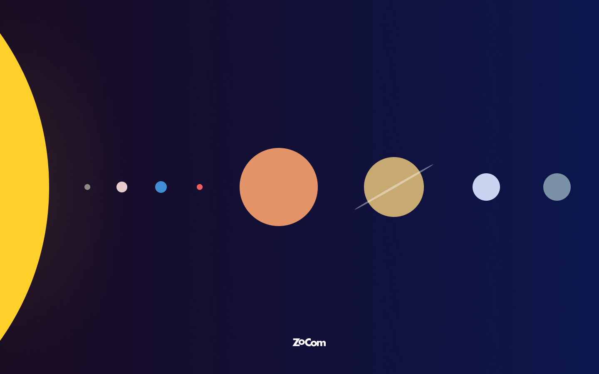

# Solaris
En webbplats byggd med HTML, CSS & vanilla JS om vårt solsystem.

## UI
Förslag på UI hittar ni [här](https://www.figma.com/file/Snw8n1gba7Mbk6TCLEAB1A/JS-%2F-Solaris?node-id=0%3A1).

## API
**Base URL**
```
[https://majazocom.github.io/Data/solaris.json](https://majazocom.github.io/Data/solaris.json)
```

**Methods**
|enpoint|method|desc|
|---|---|---|
|/keys|POST|returnerar en API nyckel.|
|/bodies|GET|returnerar alla stora himlakroppar i vårt solsystem.|


**Authentication**

API:et är låst med en API-nyckel. Alla GET-request utan en sådan kommer generar en ```401```. 

För att få läsrättigheter måste du i din request bifoga headern ```x-zocom``` med en giltig API-nyckel.

Ex. 

```js
let resp = await fetch('https://majazocom.github.io/Data/solaris.json');
```

## Modell
|egenskap|datatyp|enhet|
|---|---|---|
|id|number|-|
|type|string|star & planet|
|name|string|namnet på himlakroppen|
|latinName|string|Latinska namnet på himlakroppen|
|rotation|number|Längd på dygn i antal *jorddygn* runt sin egen axel|
|circumference|number|Omkrets i km|
|temp|Object|Temperatur *day* och *night* i celcius.|
|distance|number|km från solen|
|orbitalPeriod|Number|Antal *jorddygn* runt solen|
|desc|string|Beskrivning av himlakroppen|
|moons|Array|Lista med månarnas namn|

### Exempel

```js
{
    id: 2,
    type: 'planet',
    name: 'Venus',
    latinName: 'Venus',
    rotation: 116,
    circumference: 38025,
    temp: {
        day: 430,
        night: -173
    },
    distance: 10820000,
    orbitalPeriod: 225,
    desc: 'Venus har ...',
    moons: []
}
```

## Godkänt:
* Använt HTML, CSS (inkl. flexbox eller grid) och Vanilla JS 
* Kan söka på planeter med hjälp av textsök
* Visa sökresultat på ett snyggt sätt (Kan presentera vald planet på ett snyggt vis (ex. lightbox))

## Väl godkänt:
* Effekter på planeter mha CSS och JS. Ex: rotation vid hover, fina slides vid inladdning av planet
* Pagination-funktionalitet. Kunna bläddra mellan olika sidor av sökresultaten
* Felhantering där felkod presenteras användaren

## Level-ups:
* Local storage och visa ny sida med vald planet
* Extra info om planeterna
* Animationer
* Något eget kreativt och unikt
* Ett easter egg?
